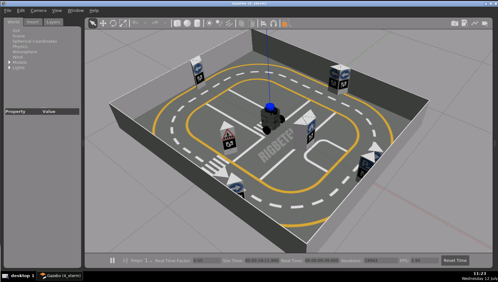

# Checkpoint 23 — TortoiseBot Waypoints (ROS 1 Tests)

ROS 1 Python **waypoint action server** with **`rostest` node-level tests** for the **TortoiseBot** differential-drive robot. The `tortoisebot_action_server.py` drives the robot toward a 2D `geometry_msgs/Point` goal by alternating between a *fix-yaw* state (face the goal) and a *go-to-point* state (drive forward). A `rostest` launch then checks that the **final position** and **final yaw** fall within tolerance. Built for **Task 1** of the Checkpoint 23 grading guide, which expects both a passing and a failing run to be reproducible from this README.

<p align="center">
  
</p>

## How It Works

### Action Interface (`tortoisebot_msgs/action/WaypointAction.action`)

```text
# Goal
geometry_msgs/Point position
---
# Result
bool success
---
# Feedback
geometry_msgs/Point position
string state
```

### Action Server (`tortoisebot_action_server.py`)

1. Advertises the `tortoisebot_as` `SimpleActionServer` on startup and subscribes to `/odom` for pose feedback
2. On goal receipt, extracts `(x, y)` from the goal, reads the current pose, and runs a small state machine:
   - **`fix yaw`** — rotates in place (`cmd_vel.angular.z`) until `|desired_yaw − current_yaw| ≤ yaw_precision` (`π/90 rad`, i.e. 2°)
   - **`go to point`** — drives straight (`cmd_vel.linear.x`) until `hypot(dx, dy) ≤ dist_precision` (`0.05 m`)
   - **`idle`** — publishes a zero twist and returns `success = true`
3. Publishes `geometry_msgs/Twist` on `/cmd_vel` at 25 Hz throughout

### Node-Level Tests (`test/test_waypoints.py` + `test/waypoints_test.test`)

Two test cases driven by `rostest`:

| Test | What it checks |
|---|---|
| End position | Sends a goal via `tortoisebot_as`, waits for the result, then asserts the final `[x, y]` from `/odom` is within `pos_tol` of `expected_{x,y}` |
| End yaw | Computes the desired yaw as `atan2(goal_y − start_y, goal_x − start_x)` and asserts the final yaw is within `yaw_tol_deg` (converted to radians) |

Parameters are exposed in the `.test` launch file so grading toggles don't require rebuilding:

```xml
<launch>
  <param name="goal_x" value="-0.5"/>
  <param name="goal_y" value="0.0"/>
  <param name="expected_x" value="-0.5"/>
  <param name="expected_y" value="0.0"/>
  <param name="pos_tol" value="0.25"/>
  <param name="yaw_tol_deg" value="20"/>
  <test test-name="test_waypoints"
        pkg="tortoisebot_waypoints"
        type="test_waypoints.py"
        time-limit="300.0"/>
</launch>
```

## ROS 1 Interface

| Name | Type | Direction | Description |
|---|---|---|---|
| `/tortoisebot_as` | `tortoisebot_msgs/WaypointAction` | action server | Goal / feedback / result endpoint |
| `/odom` | `nav_msgs/Odometry` | sub | Pose source for both server and tests |
| `/cmd_vel` | `geometry_msgs/Twist` | pub | Velocity command |

## Project Structure

```
tortoisebot_waypoints/
├── scripts/
│   └── tortoisebot_action_server.py   # ROS 1 action server (Python 3)
├── test/
│   ├── test_waypoints.py              # rostest test node
│   └── waypoints_test.test            # rostest launch (goal + tolerances)
├── media/
├── CMakeLists.txt
└── package.xml
```

The `WaypointAction.action` interface lives in a sibling `tortoisebot_msgs` package.

## How to Use

### Prerequisites

- ROS **Noetic** (Python 3 — the test node uses f-strings, the action server shebang must be `python3`)
- Gazebo (bundled with `tortoisebot_gazebo`)
- `rospy`, `actionlib`, `geometry_msgs`, `nav_msgs`, `tf`
- `rostest` (via `<test_depend>rostest</test_depend>` in `package.xml`)

### Build

```bash
cd ~/simulation_ws
catkin_make
source devel/setup.bash
```

If the server script is still using `python` in its shebang, flip it to `python3` and make it executable:

```bash
sed -i '1s|python$|python3|' ~/simulation_ws/src/tortoisebot_waypoints/scripts/tortoisebot_action_server.py
chmod +x ~/simulation_ws/src/tortoisebot_waypoints/scripts/tortoisebot_action_server.py
```

### Launch the simulation

```bash
# Terminal 1 — TortoiseBot + playground world in Gazebo
source /opt/ros/noetic/setup.bash
source ~/simulation_ws/devel/setup.bash
roslaunch tortoisebot_gazebo tortoisebot_playground.launch
```

If Gazebo hangs, kill any lingering `gzserver` processes:

```bash
ps faux | grep gz
kill -9 <pid>
```

<p align="center">
  
</p>

### Run the action server

```bash
# Terminal 2
source /opt/ros/noetic/setup.bash
cd ~/simulation_ws && catkin_make && source devel/setup.bash
rosrun tortoisebot_waypoints tortoisebot_action_server.py
```

Expected logs: `Action server started`, then `fix yaw` / `go to point` state transitions when a goal arrives. The server advertises `/tortoisebot_as`, publishes to `/cmd_vel`, and subscribes to `/odom`.

### Run the tests

```bash
# Terminal 3
source /opt/ros/noetic/setup.bash
cd ~/simulation_ws && catkin_make && source devel/setup.bash
rostest tortoisebot_waypoints waypoints_test.test --reuse-master
```

`--reuse-master` keeps the Gazebo master alive between runs.

## Pass / Fail Scenarios

Edit `tortoisebot_waypoints/test/waypoints_test.test` — no rebuild needed for `.test` file changes:

### Passing run — both tests green

Default parameters (goal and `expected_*` match, loose tolerances):

```xml
<param name="goal_x" value="-0.5"/>
<param name="goal_y" value="0.0"/>
<param name="expected_x" value="-0.5"/>
<param name="expected_y" value="0.0"/>
<param name="pos_tol" value="0.25"/>
<param name="yaw_tol_deg" value="20"/>
```

Expected summary:

```
[ROSTEST]-----------------------------------------------------------------------
SUMMARY
 * RESULT: SUCCESS
 * TESTS: 2
 * ERRORS: 0
 * FAILURES: 0
```

### Failing run — position mismatch

Make the expected pose unreachable within the tolerance:

```xml
<param name="expected_x" value="2.0"/>
<param name="expected_y" value="2.0"/>
<param name="pos_tol"    value="0.05"/>
```

### Failing run — yaw mismatch

Drop the yaw tolerance to zero so any heading error breaks the assertion:

```xml
<param name="yaw_tol_deg" value="0"/>
```

Expected summary for either failing variant:

```
[ROSTEST]-----------------------------------------------------------------------
SUMMARY
 * RESULT: FAIL
 * TESTS: 1
 * ERRORS: 1
 * FAILURES: 0
```

Re-run the tests:

```bash
cd ~/simulation_ws && catkin_make && source devel/setup.bash
rostest tortoisebot_waypoints waypoints_test.test --reuse-master
```

### Sanity checks

```bash
rostopic list | grep -E "odom|cmd_vel|tortoisebot_as"
rostopic echo /odom -n 1
rostopic echo /cmd_vel
```

## Key Concepts Covered

- **ROS 1 action server** in Python (`actionlib.SimpleActionServer`) with a custom `.action` interface
- **Yaw from quaternion** via `tf.transformations.euler_from_quaternion` for state-machine control
- **Node-level `rostest`** — parametric `.test` launch + Python test node with `unittest`-style assertions
- **Deterministic pass/fail reproduction** by toggling goal / expected / tolerance parameters in the `.test` file
- **Python 3 compatibility on Noetic** — explicit `python3` shebang and executable bit on test + server scripts

## Technologies

- ROS 1 Noetic
- Python 3 (`rospy`, `actionlib`, `nav_msgs`, `geometry_msgs`, `tf`)
- `rostest` (`tortoisebot_msgs` custom action)
- TortoiseBot differential-drive robot in Gazebo
